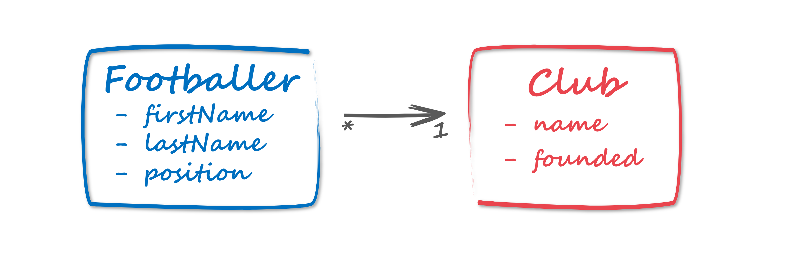

# A REST based microservice with GO

This repo contains a simple example written in [Go](https://golang.org/).

## Entity–relationship model



_Note:_ This example uses a postgres database

## Setup
Due to the fact that one of the dependencies need a Go version with modules, a module for theis service has to be 
created: 
```
> go mod init github.com/pkutschera/go-rest-footballer
 ```

## Installation
The necessary dependencies (handler framework, postgres) have to be installed using
```
> go get github.com/gorilla/mux  
> go get -u github.com/fergusstrange/embedded-postgres
> go get -u github.com/lib/pq
 ```

## DB Setup
In postgres two tables have been created using pgadmin resulting in the following schema definition:
```
CREATE TABLE public.club
(
    id integer NOT NULL DEFAULT nextval('club_id_seq'::regclass),
    name "char"[] NOT NULL,
    founded "char"[] NOT NULL,
    CONSTRAINT club_pkey PRIMARY KEY (id)
)

TABLESPACE pg_default;

ALTER TABLE public.club
    OWNER to postgres;

CREATE TABLE public.footballer
(
    id integer NOT NULL DEFAULT nextval('footballer_id_seq'::regclass),
    firstname "char"[] NOT NULL,
    lastname "char"[] NOT NULL,
    "position" "char"[] NOT NULL,
    clubid integer NOT NULL DEFAULT nextval('footballer_club_seq'::regclass),
    CONSTRAINT footballer_pkey PRIMARY KEY (id),
    CONSTRAINT "clubid constraint" FOREIGN KEY (clubid)
        REFERENCES public.club (id) MATCH SIMPLE
        ON UPDATE NO ACTION
        ON DELETE NO ACTION
        NOT VALID
)

TABLESPACE pg_default;

ALTER TABLE public.footballer
    OWNER to postgres;

CREATE INDEX "fki_clubid constraint"
    ON public.footballer USING btree
    (clubid ASC NULLS LAST)
    TABLESPACE pg_default;

 ```

##Strating the REST service
The service should start on port 8090. 
```
> go run .
 ```

## Call the REST API

[Postman](https://www.getpostman.com/) can be used to create the clinet requests.

E.g. to create a new _Club_ you need to do a POST to `http://localhost:8090/clubs` with a payload like this:
```json
{
  "name": "Real Madrid",
  "founded": 1902
}
```
To GET a all _Clubs_ call `http://localhost:8090/clubs`, to get a certain _Club_ by its ID call `http://localhost:8090/clubs/1`

To create a _Footballer_ and associate it to a previously created _Club_ POST this to  `http://localhost:8090/footballers`:
```json
{
  "footballer": {
    "firstName": "Toni",
    "lastName": "Kroos",
    "position": "Midfield"
  },
  "clubId":1
}
```

To GET all _Footballers_ you have to call `http://localhost:8090/footballers`. 

To GET all _Footballers_ for a certain _position_ please add the request parameter `position` (e.g. `http://localhost:8090/footballers?position=Midfield`) 

## Next steps
- ORM
- ...
